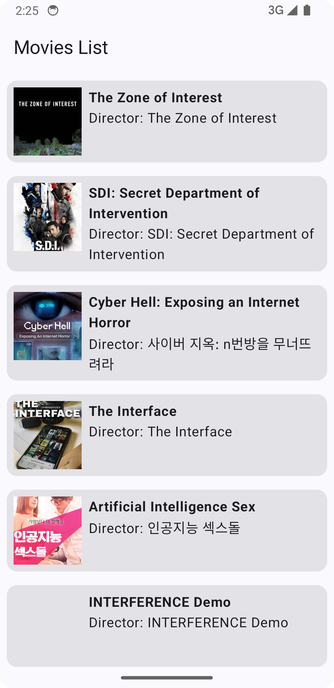

# 🎬 Android Movie App

An Android Movie App built with **Jetpack Compose**, **Retrofit**, **Hilt**, and **Coil**, using **The Movie Database (TMDb) API** to fetch and display movie details.

## ✨ Features
- 🎥 Browse popular and top-rated movies
- 🔍 Search for movies
- 📜 View detailed movie information (title, description, rating, etc.)
- 🌆 Display movie posters using **Coil**
- ⚡ Built with **Jetpack Compose** for modern UI
- 🔄 Fetch data from **The Movie Database (TMDb) API** using **Retrofit**
- 🛠 Dependency Injection with **Hilt**

## 🛠 Tech Stack
- **Kotlin** - Primary programming language
- **Jetpack Compose** - UI toolkit for building declarative UIs
- **Retrofit** - For making network requests
- **Hilt** - Dependency Injection
- **Coil** - Image loading library
- **Coroutines & Flow** - Asynchronous programming
- **Room DB** - Offline Data

## 🚀 Getting Started
### Prerequisites
- Android Studio Flamingo or later
- Minimum SDK: 23
- API Key from [TMDb](https://www.themoviedb.org/)

### Setup
1. Clone the repository:
   ```sh
   git clone https://github.com/yourusername/MovieApp.git
   cd MovieApp
   ```
2. Get an API key from [The Movie Database (TMDb)](https://www.themoviedb.org/signup)
3. Add your API key in `local.properties`:
   ```properties
   TMDB_API_KEY=your_api_key_here
   ```
4. Sync the project and run the app on an emulator or a real device.

## 📸 Screenshots


## 🏗 Architecture
The project follows **MVVM (Model-View-ViewModel)** architecture for better code organization and maintainability.

## 📜 API Usage
This app fetches movie data using **The Movie Database (TMDb) API**. For more details, visit the [TMDb API documentation](https://developers.themoviedb.org/3).

## 📌 TODOs
- [ ] Implement pagination for infinite scrolling
- [ ] Add favorite movies feature
- [ ] Implement offline caching

## 👨‍💻 Author
**Your Name** - [GitHub](https://github.com/ganeshshirole)

## 📜 License
This project is licensed under the **MIT License** - see the [LICENSE](LICENSE) file for details.

---
💡 *If you like this project, don't forget to ⭐ star the repo!*

